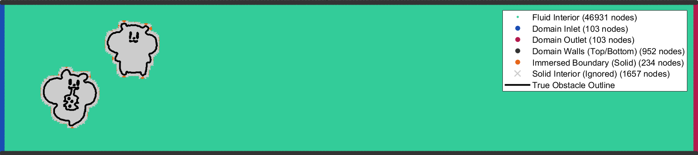
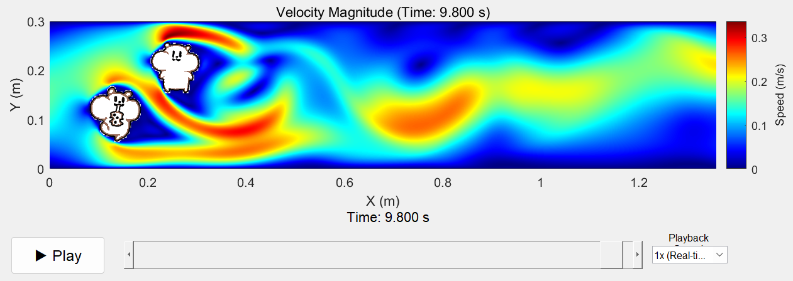

# CFDRAT: Just Draw It, Then Simulate It.
[]()

[Chinese Version](https://github.com/RatEmperior/CFDRAT-zh) 

<p align="center">
  
  
  <br>
  <em>Flow Around Objects</em>
</p>

**CFDRAT** is a MATLAB solver that turns any 2D image into a fluid dynamics simulation. Here, no complex operations are needed - just an image is required to complete a simulation in minutes.

This simulation platform primarily targets laminar flow in regular regions. Created out of personal interest, it's intended for entertainment and educational purposes only.

## Key Features

-   **Quick Start:** Comes with GUI, easy to use
-   **Geometry Extraction:** Automatically extracts object boundaries from images and generates grids.
-   **Interactive Post-processing:** Built-in animation player with play/pause, timeline scrubbing, and playback speed adjustment.

## Reproduce the Above Flow Simulations

Want to generate these interesting physical phenomena? The operation is simple:

1.  **Requirements:** Install MATLAB R2020b or later.
2.  **Download Project:** Get all files via `git clone` or direct ZIP download.
3.  **Run Program:** Open MATLAB, navigate to the project folder `CFDRAT/`, then enter in command window:
    ```matlab
    cfdrat()
    ```
    
4.  **Start Simulation:** At this point, the program's GUI interface will automatically open with all example parameters pre-filled. Simply click the "Start Simulation" button.

<p align="center">
  
</p>

5.  **Enjoy Results:** The program will automatically perform grid generation, calculation and solving. Complete in about 3 minutes, then pop up an interactive animation playback window.

## How to Define Your Own Scenarios

Simulate any scenario you're interested in, requiring only one image. Here are the steps from input image to result visualization.

1.  In the **"Obstacle Image"** area on the left side of the GUI interface, click the **`Browse...`** button to select your own image to load the object. The computational domain origin defaults to the bottom-left corner of the image.

<p align="center">
  
</p>

2.  As needed, adjust parameters like "Computational Domain Height", "Inlet Velocity" and "Fluid Viscosity" in the interactive interface to adjust the fluid environment. Computational domain length, obstacle position and other information are naturally determined by the image aspect ratio.

3.  Specify save location: Click the **`Select...`** button next to **"Result Save Location"**, specify a folder, and pre-enter the data filename to store the result data (`.mat` file) from this simulation.

4.  Grid check: Click the **"Start Simulation"** button, the program will automatically generate a grid for user inspection to decide whether to continue with the simulation.

<p align="center">
  
</p>

5. Start calculation: After confirmation, the program will begin calculation, with progress prompts visible in the command line. Large-scale calculations require some time, please be patient.

6. Visualization: After successful simulation completion, the program will pop up an interactive animation player showing the calculated results.

<p align="center">
  
</p>

## How to Load Previous Simulation Results

1.  In the **"Result Visualization"** area on the right side of the GUI interface, click the **`Browse...`** button next to "Data File".

2.  In the pop-up window, find and select the result data file you previously saved (it's a `.mat` file).

3.  Click the blue **"Play Animation"** button, and the program will load the data and display the corresponding flow field animation.

## Technical Architecture

-   Solver Algorithm: PISO.
-   Spatial Discretization: Based on finite difference method, using staggered grid and second-order upwind discretization scheme
-   Obstacle Boundary Processing: Staircase approximation.
-   Solver: Uses preconditioned stabilized biconjugate gradient method and conjugate gradient method

## Learn More
 
Reference usage details
 
*   ➡️ **[User Guide](user-guide.md)**

## Author

-   **[RatEmperior](https://github.com/RatEmperior)**
    

