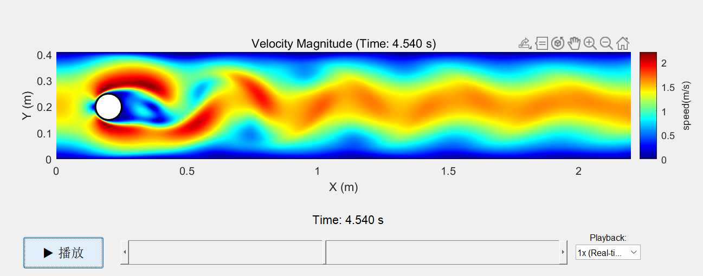
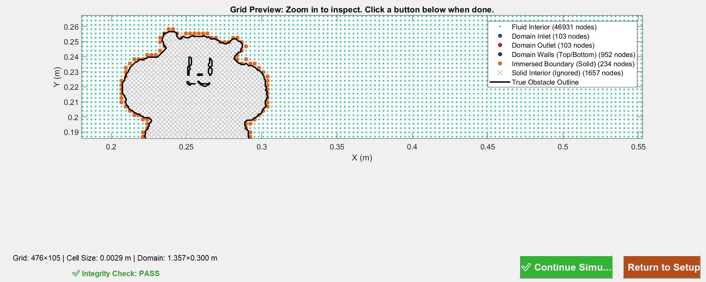

# CFDRAT - User Guide

## 1. Basic Concepts

With limited personal resources, CFDRAT only implements simulations in specific scenarios:

*   **Computational Domain**

    The computational domain is a 2D rectangle. Its physical height `H` is set by you. Its width will be automatically determined based on the aspect ratio of the obstacle image you provide.

*   **Boundary Conditions**
    *   **Left Inlet**: Uses velocity inlet, can define velocity profile through a mathematical expression.
    *   **Right Outlet**: Uses constant pressure outlet, allowing fluid to naturally flow out.
    *   **Top and Bottom Walls**: Optional no-slip or slip conditions.
    *   **Obstacle**: Uses no-slip boundary condition.
    
    Classic cylinder flow case:
   <p align="center">
   
   </p>

*   **Computational Grid**

    Uses structured grid to discretize the computational domain. Grid density is determined by `Node Count`.

*   **Object Recognition**

    Use images with clear contours, minimal burrs, and no surrounding borders.

---

## 2. Quick Start: Complete a Simulation

### **Step 1: Launch GUI**
Open MATLAB, switch current path to the project folder `CFDRAT/`, enter the following command in the command window and press Enter:
  ```matlab
cfdrat()
```
This opens CFDRAT's GUI interface.
<p align="center">
  
</p>

### **Step 2: Set Parameters**
To reproduce the flow in README, directly use the interface's default parameters and paths, click the green **`Start Simulation`** button. The program automatically generates grid and displays it, click **`Start Simulation`**.

<p align="center">
  
</p>

For custom settings:
1.  In the left panel, set core parameters like `Computational Domain Height H`, `Inlet Velocity`, etc.
2.  Click the "Browse..." button next to **`Obstacle Image`** to select any image.
3.  Click the "Select..." button next to **`Result Save Location`** to choose a folder and pre-name the stored .mat data file.

### **Step 3: Result Visualization**

After simulation ends:
1.  In the right panel, click the "Browse..." button next to **`Data File`**.
2.  Find and select the just-generated .mat file.
3.  Click the **`Play Animation`** button, a new window will pop up and start playing your flow field animation.

## 3. Parameter Settings

### **Simulation Parameter Setting Panel**

This panel contains all input parameters needed to run a simulation.

*   **`Computational Domain Height H (m)`**: Physical height of the rectangular simulation area. The width of the computational domain will be automatically determined based on the image aspect ratio.

*   **`Left Inlet Normal Velocity (m/s)`**: Use a mathematical expression to define the velocity profile of fluid flowing in from the left boundary.
    *   Available variables: Use `t` (current time, seconds), `y` (vertical coordinate, from 0 to H), and `H` (set height).
    *   Default value: `0.15*4*y*(H-y)/H^2` is a classic parabolic velocity profile.

*   **`Inlet Gradient Buffer`**: To avoid velocity discontinuity at simulation start, set a small buffer time during which velocity rises to the set value.
    *   **`S-curve Rise`**: smoothstep function.
    *   **`Linear Rise`**: ramp function.
    *   **`None`**: No buffering, velocity instantly reaches set value at t=0.

*   **`Wall Boundary Condition`**: Defines the interaction between fluid and top/bottom walls.
    *   **`No-slip`**: Fluid velocity at wall surface is zero.
    *   **`Slip`**: Fluid can slide frictionlessly along the wall.

*   **`Outlet Boundary Condition`**: Fixed as constant pressure outlet, this is the most robust outflow boundary condition, allowing fluid to flow freely out of the computational domain.

*   **`Fluid Density (kg/m³)`**: Mass property of fluid. Room temperature water density ~1000, air ~1.2.

*   **`Dynamic Viscosity (Pa·s)`**: "Thickness" degree of fluid. Water dynamic viscosity ~0.001.

*   **`Node Count`**: Total grid number, computational time complexity is O(n²). For ordinary laptops, 50,000 is a good starting point; above 100,000 computation dramatically increases.

*   **`Recording Time Interval (s)`**: Software saves one animation frame every this duration.

*   **`Total Simulation Duration (s)`**: Total physical world time you wish to simulate.

*   **`Solver Speed`**: Program calculates appropriate timestep based on CFL number, no need for manual setting.
    *   **`Fast`**: Uses larger CFL number, bigger timestep, faster computation.
    *   **`Medium`**: Uses more conservative CFL number, smaller timestep, more robust computation.

*   **`Parallel Computing`**: Based on experience, not recommended at hundred thousand node scale, asynchronous communication time is lengthy.

*   **`Obstacle Image`**: Click "Browse..." to select an image. Program automatically recognizes closed images.

*   **`Result Save Location`**: Click "Select..." to specify a path and filename for saving the `.mat` file containing all simulation results.

### **Result Visualization Panel**

This panel is used for playing and analyzing completed simulation results.

*   **`Data File`**: Click "Browse..." to select a previously generated `.mat` result file from simulation.

*   **`Display Mode`**: Controls how obstacles are displayed in animation.
    *   **`Internal Color Block`**: Will paste your selected obstacle's original image in the flow field.
    *   **`Boundary Only`**: Only draws the obstacle's contour lines.

*   **`Play Animation`**: Load the selected data file and pop up a new window to play interactive flow field animation. The animation player has play/pause, timeline dragging, and speed adjustment functions.

---

## 4. Other Parameters

### **Reynolds Number**

Reynolds number is the most important dimensionless number in fluid mechanics, representing the ratio of inertial forces to viscous forces. It determines flow patterns:
*   Low Reynolds number: Smooth, ordered flow (laminar).
*   High Reynolds number: Chaotic, disordered flow (turbulent).

This solver is a laminar flow solver. To ensure numerical stability and simulation authenticity, an internal Reynolds number upper limit (~`300`) is set. If your **inlet velocity** or **density** is too high, or **viscosity** is too low, causing calculated Reynolds number to exceed the limit, the program will report an error and prompt you to adjust parameters.

### **CFL Condition**

*   `Node Count` determines grid edge length `h`.
*   `Solver Speed`, `Inlet Velocity` and **`grid edge length`** together determine timestep `dt`.

These three have constraining relationships (CFL condition), meaning within one timestep, fluid particles should not "traverse" more than one grid cell. This program automatically calculates stable `dt`. You only need to balance accuracy and speed requirements by adjusting `Node Count` and `Solver Speed`.

## 5. Simulation Data

When a simulation ends, the specified `.mat` file packages all relevant metadata. After loading the `.mat` file using MATLAB's `load` command, you'll get a structure named **`info`** in the workspace.
 
The **`info`** structure contains the following core fields:
 
*  **`info.h`**: Grid edge length 
*  **`info.u_all`**, **`info.v_all`**, **`info.p_all`**: x-direction velocity field, y-direction velocity field, and pressure field data, stored in grid format. These are 3D arrays with dimensions `[y-direction node count Ny, x-direction node count Nx, time frame count]`.
* **`info.XX`**: Physical x-coordinates of quantities on the grid.
* **`info.YY`**: Physical y-coordinates of quantities on the grid.
*   **`info.T_record`**: Recording time interval (s).
*   Other metadata: All parameters like `dt` (simulation timestep), `t_simu` (total duration), `node_scale` (node count) etc. are saved.

